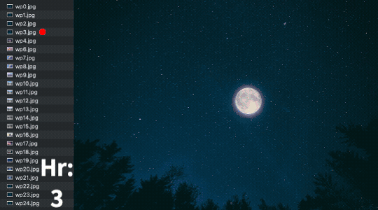

# 24-Hour Dynamic Wallpaper for M1 MacBook Pro

## Overview

This repository provides a script to set a dynamic wallpaper on your M1 MacBook Pro that changes every hour. The wallpaper images are named `wp{n}.jpg`, where n is the hour (0-24). Here is example and the images source is Pininterest:

<p align="center">
  
</p>

## Prerequisites

- MacOS: Ensure you're running macOS on an M1 MacBook Pro.
- Homebrew: If you haven't already, install Homebrew

## Installation

  1. `brew install cron` in command line
  2. Clone this Repository:
   
   ```bash
git clone https://github.com/your-username/24-hour-dynamic-wallpaper.git
   ```

  3. Create the wallpaper folder, `{path/wallpaper}`
  4. Prepare Wallpaper Images in the folder, `{path/wallpaper, wp1.jpg, wp2.jpg...` (jpg format) Of course, you can change the code for using other format.
  5. Setup Cron, `crontab -e` in terminal and copy:
```
0 * * * * osascript -e 'tell application "Finder" to set desktop picture to POSIX file "{path}/wp'$(date +\%H)'.jpg"'
``` 
  6. Press `Esc`, and then Press `:wq` and then `Enter` to save the cron file and you can try `crontab -l` to see the mission.


## Common Issue

### A. Grant Full Disk Access:

> To ensure the script can run without restrictions, grant it full disk access:

1. Go to: System Settings > Privacy & Security > Full Disk Access
2. Click: The `"+"` icon
3. Navigate: Use `Control+Shift+G` to open the Go to Folder dialog
4. Enter: The path to your cron executable. For most systems, this is `/usr/sbin/cron`.
   
### B. WallPaper Setting

> To ensure the script can run without error, use simple WallPaper setting:

1.  Go to: System Settings > WallPaper
2.  Be careful -> don't click `Show on all Spaces` and only use the simple wallpaper (such as color) for less error.


